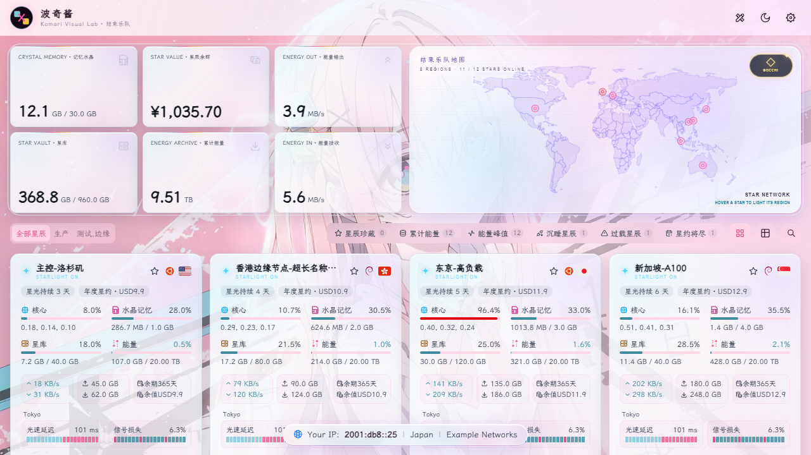
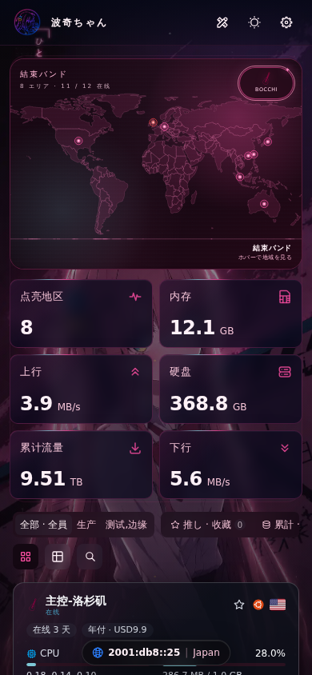
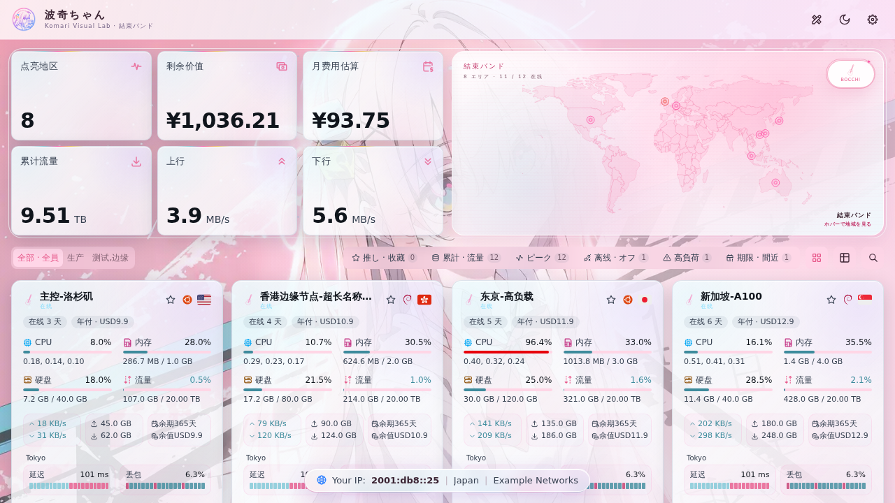
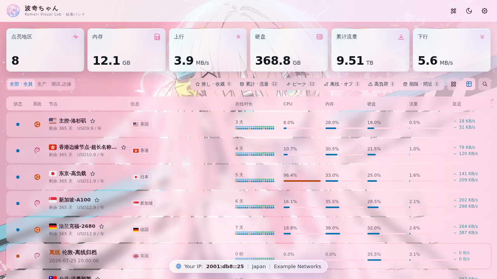
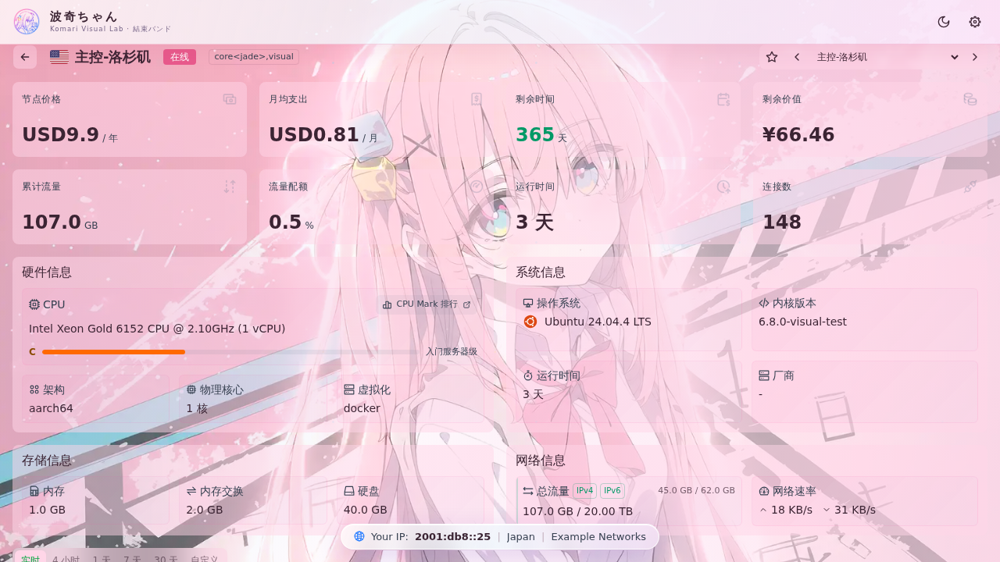
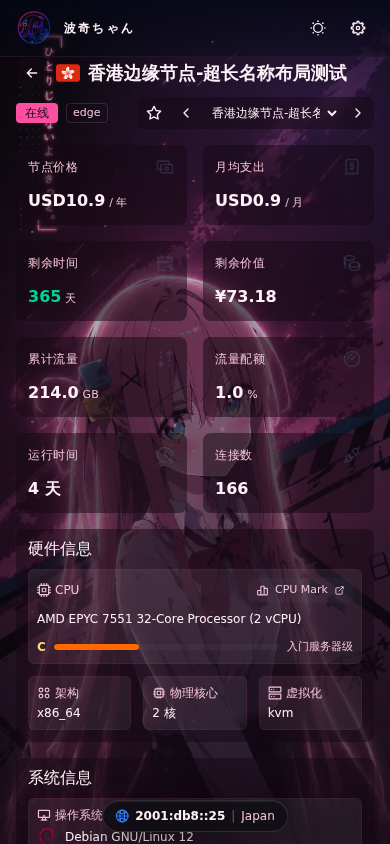
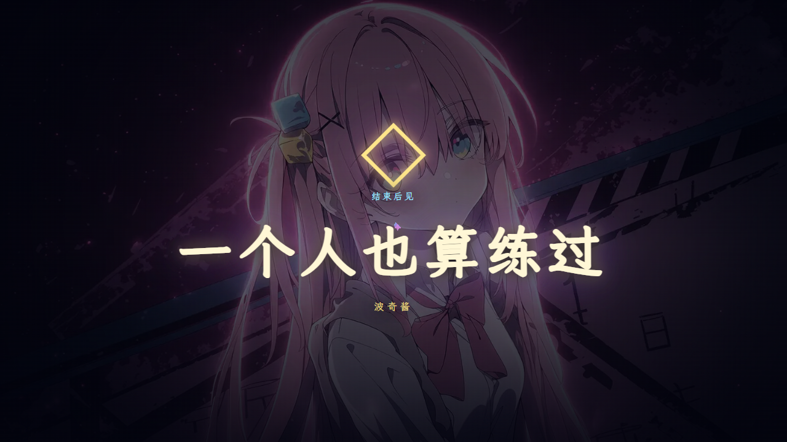
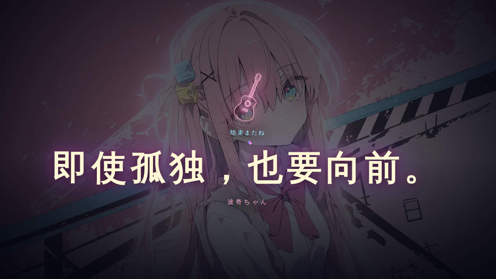
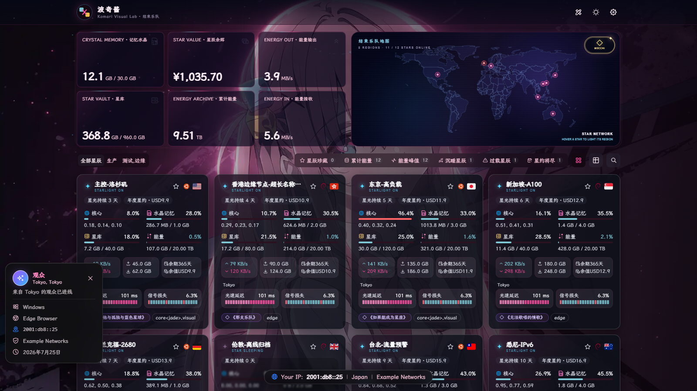
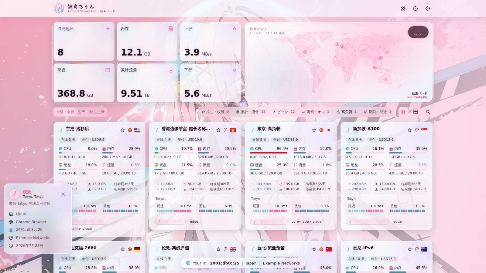

# 波奇酱 · komari-theme-Bocchi

波奇酱粉丝向的 [Komari](https://github.com/komari-monitor/komari) 监控主题：粉色玻璃卡片、霓虹粉夜里模式、明亮 / 夜里 × 桌面 / 手机四套背景，以及两个点一下就会亮的波奇彩蛋。

<p align="center">
  
</p>

- 主题版本：`1.0.0`，版本号只写在 [komari-theme.json](komari-theme.json)
- 技术栈：Vue 3 + Vite + reka-ui + Tailwind CSS v4
- 后端基线：Komari 1.2.6，主题只提供 `/` 与 `/instance/:id` 两个公开路由，管理操作仍然交给 Komari 官方后台

## 特色

- **粉色玻璃**：明亮模式白底粉边、夜里模式霓虹粉玻璃；支持玻璃预设、自定义 JSON 配色和色觉辅助配色。
- **四套背景**：明亮 / 夜里的桌面与手机壁纸，人物在画面左侧，右侧带遮罩方便读卡片；也可以换成自己的图片。
- **两个彩蛋**：点击地图右上角按钮是夜里波奇，点击左上角头像是明亮波奇，画面正中那一句话的文案、上方短句、下方署名和字号都可以在设置里改。
- **歌曲标签与试听**：节点名可以是曲名，悬停时播放管理员自己放进主题里的音频片段，地区与曲目的对应关系也在设置里。
- **节点卡片与详情页**：四档卡片尺寸、卡片 / 列表两种视图、快捷筛选、离线置底、流量与到期预警、磁盘耗尽预测、详情概览卡片与负载 / 延迟图表。

## 截图

下面的图都是 `bun run test:visual` 跑出来的视觉快照，文件就在 [tests/visual/snapshots/chromium](tests/visual/snapshots/chromium)。

### 首页

<table>
  <tr>
    <td width="50%"></td>
    <td width="50%"></td>
  </tr>
  <tr>
    <td align="center">明亮模式 · 桌面 1280 × 720</td>
    <td align="center">夜里模式 · 手机 390 × 844</td>
  </tr>
</table>

<table>
  <tr>
    <td width="50%"></td>
    <td width="50%"></td>
  </tr>
  <tr>
    <td align="center">首页 · 网格地图布局</td>
    <td align="center">首页 · 列表视图</td>
  </tr>
</table>

### 节点详情

<table>
  <tr>
    <td width="50%"></td>
    <td width="50%"></td>
  </tr>
  <tr>
    <td align="center">详情 · 明亮模式 · 桌面</td>
    <td align="center">详情 · 夜里模式 · 手机</td>
  </tr>
</table>

### 两个彩蛋

点击地图右上角按钮（写着 `BOCCHI` 的那个）打开地图彩蛋，点击左上角头像打开头像彩蛋。两个彩蛋共用同一档字号，中间那一句都固定在画面正中。

<table>
  <tr>
    <td width="50%"></td>
    <td width="50%"></td>
  </tr>
  <tr>
    <td align="center">地图彩蛋（夜里波奇）</td>
    <td align="center">头像彩蛋（明亮波奇）</td>
  </tr>
</table>

<p align="center">
  
</p>

### 访客与管理员视角

<table>
  <tr>
    <td width="50%"></td>
    <td width="50%"></td>
  </tr>
  <tr>
    <td align="center">未登录访客 · 深空</td>
    <td align="center">未登录访客 · 星光</td>
  </tr>
</table>

## 背景

| 模式 | 桌面                      | 手机（宽度不超过 768px） |
| ---- | ------------------------- | ------------------------ |
| 明亮 | `boqi_white_desktop.webp` | `boqi_white_phone.webp`  |
| 夜里 | `boqi_dark_desktop.webp`  | `boqi_dark_phone.webp`   |

文件在 [public/images/bocchi](public/images/bocchi)。自定义背景留空时使用这四张。想换成自己的图，用设置里的「08 · 明亮/夜里自定义背景」分组。

## 安装

1. 登录 Komari 后台。
2. 打开「设置 → 主题管理」。
3. 上传构建出的 `komari-theme-Bocchi-v*.zip`。
4. 启用 `Bocchi`。

不要上传源码压缩包，主题包必须是 `bun run build` 产出的那个 zip。

## 本地开发

需要 Node.js `^20.19.0` 或 `>=22.12.0`，以及 `bun` `>= 1.2`（仓库里 `packageManager` 固定为 `bun@1.3.14`）。

```bash
bun install
bun run dev        # 本地开发服务器
bun run lint       # eslint，会直接 --fix
bun run build      # 产出 dist/ 和 komari-theme-Bocchi-v<版本>-<短 sha>.zip
bun run preview    # 预览构建产物
```

用 `pnpm` 跑同样的脚本也可以。

## 视觉回归测试

主题的界面靠 Playwright 截图守住，测试文件只有 [tests/visual/visual.spec.ts](tests/visual/visual.spec.ts) 一个，覆盖首页、列表、详情、地图、彩蛋、移动端等 36 个画面。

```bash
bun run test:visual         # 构建后与 tests/visual/snapshots/chromium 里的快照比对
bun run test:visual:update  # 本地重拍全部快照
```

- 快照在 [tests/visual/snapshots/chromium](tests/visual/snapshots/chromium)，按画面命名，例如 `home-light-desktop.png`、`gloria-easter-desktop.png`。
- 改了界面就在本地跑 `bun run test:visual:update`，确认新图没问题后再提交快照。
- CI 只做比对（`.github/workflows/visual-regression.yml`），不会替你提交快照：比对失败会给出差异图和 `playwright-report`，本地重拍即可。只想重拍受影响的画面时，可以 `bunx playwright test -g "easter" --update-snapshots=all`。

## 主题设置

设置项都在 [komari-theme.json](komari-theme.json) 的 `configuration.data` 里，后台按下面 8 组展开。

| 分组                        | 主要设置项                                                                                                                                                                |
| --------------------------- | ------------------------------------------------------------------------------------------------------------------------------------------------------------------------- |
| 01 · 宇宙模式与基础连接     | 默认主题模式、数据更新间隔、数据连接方式、默认节点视图、节点卡片尺寸（默认 `compact`，另有 `mini` / `comfortable` / `large`）                                             |
| 02 · 首页、地图、歌曲与彩蛋 | 公告、暂停地图呼吸、隐藏地图、隐藏首页总览、歌曲标签与悬停试听（音量 / 时长 / 音频映射）、地区曲目映射、彩蛋素材与文案字号、观众信息、玻璃预设、色觉辅助、玻璃自定义 JSON |
| 03 · 首页总览指标           | 总览指标预设，或用英文逗号 keys 自定义卡片与顺序                                                                                                                          |
| 04 · 管理员工具与隐私       | 登录后显示管理员工具、隐藏后台入口、未登录隐藏价格、厂商别名、导出二级密码、减弱过渡动画                                                                                  |
| 05 · 节点卡片、列表与筛选   | 快捷筛选预设与 keys、列表信息字段、列表自定义标签、离线节点置底、高负载 / 流量预警 / 即将到期阈值、磁盘耗尽预测                                                           |
| 06 · 节点详情概览卡片       | 详情页分区标签页、详情概览卡片预设与 keys                                                                                                                                 |
| 07 · 节点详情监控图表       | GPU 指标图开关、详情负载图预设与 keys                                                                                                                                     |
| 08 · 明亮/夜里自定义背景    | 自定义背景开关、素材类型、明亮与夜里背景地址、模糊半径、遮罩强度                                                                                                          |

彩蛋相关的设置项：

| 设置项               | 默认值               | 说明                               |
| -------------------- | -------------------- | ---------------------------------- |
| `easterMapSlogan`    | `即使结束，也要再见` | 地图彩蛋画面中间那一句             |
| `easterAvatarSlogan` | `即使孤独，也要向前` | 头像彩蛋画面中间那一句             |
| `easterEyebrow`      | `结束またね`         | 两个彩蛋画面中间的短句上方         |
| `easterSignature`    | `波奇ちゃん`         | 两个彩蛋画面中间的短句下方         |
| `easterSloganMin`    | `2.2`（rem）         | 中间那一句的最小字号，两个彩蛋共用 |
| `easterSloganFluid`  | `7`（vw）            | 屏幕变宽时的字号比例               |
| `easterSloganMax`    | `5.8`（rem）         | 中间那一句的最大字号，两个彩蛋共用 |

## 目录结构

```text
src/
  components/       界面：首页、详情、地图、彩蛋、玻璃卡片等
  views/            路由页面（/ 与 /instance/:id）
  composables/      Vue 状态与生命周期胶水
  services/         业务逻辑与数据组织
  stores/           Pinia 全局状态，主题设置在这里归一化
  utils/            纯工具与底层 API / RPC 客户端
  constants/        共享常量
tests/visual/       Playwright 视觉测试与快照
public/images/      运行时会用到的图片，文件名是代码契约
docs/               架构、鉴权、缓存、数据流、迁移与里程碑文档
```

新代码沿着 `Component → Composable → Service → RequestManager / CacheService → API / RPC` 分层写，不要把业务逻辑塞进组件，也不要在组件里直接解析 `theme_settings`。

## 声明

这是粉丝向主题，和动画、漫画、音乐的权利人没有关系。背景图由主题作者提供。主题不内置音乐；歌曲名只作为节点标签，试听仍只播放管理员自己放进去、并且有权使用的音频。

基础工程是 [komari-theme-Glassmorphism](https://github.com/sanrokamlan-prog/komari-theme-Glassmorphism)（MIT），布局和数据沿用 [Gloria Universe](https://github.com/TonyStarkJr2021/komari-theme-Gloria-Universe)。

## 许可

MIT，见 [LICENSE](LICENSE)。
